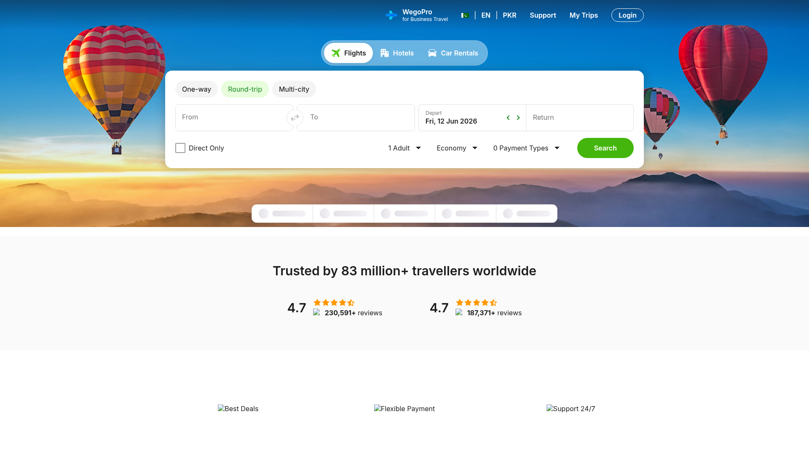

# DESIGN.md: Wego.pk

## Source
- **URL**: https://www.wego.pk/
- **Capture date**: 2026-06-12
- **Evidence**: Live CSS (`/roxana/main.328171dc.css` — Wego Web System v0.0.14), Firecrawl branding JSON (confidence 0.925), Firecrawl content markdown, full-page screenshot, hero-bg PNG, in-browser HTML inspection

---

## Reference Screenshot


> Use this screenshot as the primary visual source of truth for layout, hierarchy, density, and feel. Tokens below describe the same page in machine-readable form.

---

## Reference Hero Background


---

## Design Summary

Wego.pk is a modern, light-themed travel search aggregator targeting Pakistani travellers. The visual language is clean and trustworthy with energetic accents. Key characteristics:

- **Navbar**: Sky-blue (`#0090CC`) fixed header with white logo text + green plane icon
- **Hero**: Full-bleed mountain/hot-air-balloon photography (pk_1.png) with the search card floating on top, centred, white card with sharp shadow
- **Accent**: Vivid grass-green (`#44B50C`) used exclusively for CTAs, active states, and brand badges
- **Below the fold**: Minimal white sections — trust bar with ratings, 3 feature cards with Wego mascot illustrations, app download with phone mockup, FAQ accordion, 4-column footer
- **Typography**: Inter exclusively (Latin), with Arabic fallback (Geeza Pro). Clean, modern, high-legibility
- **Motion**: Subtle 150–250ms ease-in-out transitions; balloon float animations in hero

---

## Design Tokens

### Colors (observed directly from `/roxana/main.328171dc.css` — `/* Wego Web System v0.0.14 */`)

#### Light Mode (`:root`)
| Token | Hex | Role |
|---|---|---|
| `--wp-bg-primary` | `#FFFFFF` | Page background |
| `--wp-bg-secondary` | `#FAFAFA` | Subtle grey bg |
| `--wp-bg-tertiary` | `#F4F4F4` | Card/input hover bg |
| `--wp-bg-surface` | `#FFFFFF` | Card surfaces |
| `--wp-bg-active` | `#E7FDDC` | Active/selected bg (light green) |
| `--wp-bg-highlight` | `#FDF5CB` | Highlight/promo bg |
| `--wp-bg-warning` | `#FFF0E0` | Warning bg |
| `--wp-bg-destructive` | `#FFEEEE` | Error/destructive bg |
| `--wp-bg-exception` | `#EBF5FF` | Info/exception bg |
| `--wp-bg-inverse` | `#1D1D1D` | Inverse (dark) bg |
| `--wp-bg-active-positive` | `#44B50C` | **Primary CTA green** |
| `--wp-bg-solid-positive` | `#188920` | Dark green (hover state) |
| `--wp-bg-solid-warning` | `#FF8000` | Orange warning |
| `--wp-bg-solid-destructive` | `#CF000F` | Red destructive |
| `--wp-bg-solid-exception` | `#016CD5` | Blue info |
| `--wp-txt-primary` | `#1D1D1D` | **Primary text** |
| `--wp-txt-secondary` | `#767676` | Secondary/muted text |
| `--wp-txt-disabled` | `#BDBDBD` | Disabled text |
| `--wp-txt-active-primary` | `#44B50C` | Active/green text |
| `--wp-txt-active-secondary` | `#188920` | Dark green text |
| `--wp-txt-active-label` | `#188920` | Active label text |
| `--wp-txt-warning` | `#D85D0D` | Warning text |
| `--wp-txt-destructive` | `#CF000F` | Error text |
| `--wp-txt-inverse` | `#FFFFFF` | Inverse white text |
| `--wp-txt-link` | `#016CD5` | Link blue |
| `--wp-ic-primary` | `#1D1D1D` | Primary icons |
| `--wp-ic-secondary` | `#767676` | Secondary icons |
| `--wp-ic-disabled` | `#BDBDBD` | Disabled icons |
| `--wp-ic-active-primary` | `#44B50C` | Active green icons |
| `--wp-ic-highlight` | `#FF9800` | Highlight/star orange |
| `--wp-cta-primary` | `#44B50C` | **Search/CTA button green** |
| `--wp-cta-primary-tap` | `#188920` | CTA pressed/hover |
| `--wp-cta-secondary-tap` | `#E7FDDC` | Secondary CTA pressed |
| `--wp-cta-disabled` | `#DFDFDF` | Disabled CTA |
| `--wp-cta-optional` | `#1D1D1D` | Optional/ghost CTA |
| `--wp-line-active` | `#1D1D1D` | Active border |
| `--wp-line-inactive` | `#DFDFDF` | Default border |
| `--wp-line-divider` | `#F4F4F4` | Divider line |
| `--wp-line-selected` | `#44B50C` | Selected border (green) |
| `--wp-go-bg-primary` | `#532CCE` | WegoPro purple |
| `--wp-go-bg-secondary` | `#735CF7` | WegoPro light purple |
| `--wp-go-bg-tertiary` | `#E5E6FD` | WegoPro bg |
| `--wp-go-txt-primary` | `#532CCE` | WegoPro text |

#### Observed Page-Level Colors (not in CSS vars)
| Color | Hex | Usage |
|---|---|---|
| Navbar blue | `#0090CC` | Fixed navbar background (observed from screenshot) |
| Orange "New" badge | `#FF7A00` | "New" pill on Umrah e-Visa |
| Star rating orange | `#F59E0B` | 4.7-star rating fill |
| Visa bar bg | `rgba(255,255,255,0.95)` | Frosted glass visa options pill |
| Search tabs bg | `rgba(0,0,0,0.25)` | Dark translucent pill with backdrop-blur |

---

### Typography

**Source**: `--wp-font-latin: "Inter", "Noto Sans", sans-serif` from CSS

| Token | Value |
|---|---|
| Primary font | `Inter` |
| Arabic fallback | `Geeza Pro`, `Noto Naskh Arabic` |
| Generic fallback | `sans-serif` |
| Font weights | 300 (light), 400 (regular), 500 (medium), 600 (semibold), 700 (bold) |
| Font loading | Preloaded woff2 via Cloudflare Fonts — weight 300–700 |

#### Type Scale (from CSS variables)
| Token | Size | Line Height | Usage |
|---|---|---|---|
| `--wp-text-2xs` | `0.625rem` (10px) | — | Tiny labels |
| `--wp-text-xs` | `0.75rem` (12px) | `1.333` | Small badges |
| `--wp-text-sm` | `0.875rem` (14px) | `1.429` | Secondary text, nav links |
| `--wp-text-base` | `1rem` (16px) | `1.5` | Body text |
| `--wp-text-lg` | `1.25rem` (20px) | `1.4` | Larger body |
| `--wp-text-xl` | `1.5rem` (24px) | `1.333` | Section subheadings |
| `--wp-text-2xl` | `1.875rem` (30px) | `1.067` | Section headings |
| `--wp-text-3xl` | `2.25rem` (36px) | — | Page hero headings |

#### Typography Patterns
- **Navbar links**: 14px / semibold / white
- **Logo "wego"**: 24px / black (900) / italic / letter-spacing -0.03em / white
- **Search tab labels**: 14–15px / semibold / active=white, inactive=white/70
- **Search button "Search"**: 15px / bold / white on `#44B50C`
- **Trip type pills**: 14px / medium
- **Section headings**: 24–30px / black (900) / `#1D1D1D`
- **Feature card titles**: 16px / bold / `#1D1D1D`
- **Footer column headings**: 14px / bold / `#1D1D1D`
- **Footer links**: 13px / regular / `#767676`

---

### Spacing And Layout

**Base unit**: `0.25rem` (4px) — matches `--wp-spacing: .25rem`

#### Container & Grid
| Property | Value |
|---|---|
| Max container | `max-w-7xl` (1280px) |
| Section padding | `px-4 sm:px-6 lg:px-8` |
| Navbar height | `64px` fixed |
| Hero min-height | `calc(100vh - 64px)` |
| Search card max-width | `max-w-4xl` (896px) |

#### Border Radius
| Token | Value | Usage |
|---|---|---|
| `--wp-radius-lg` | `0.5rem` (8px) | Cards, inputs |
| `--wp-radius-xl` | `0.75rem` (12px) | Larger cards |
| `--wp-radius-2xl` | `1rem` (16px) | Search card, modals |
| `rounded-full` | `3.40282e38px` | Buttons, pills (fully round) |
| 100px | `100px` | Primary/secondary buttons |

#### Shadows
| Usage | Value |
|---|---|
| Card sm | `0 1px 3px #0000001a, 0 1px 2px #0000001a` |
| Card lg | `0 10px 15px -3px #0000001a, 0 4px 6px -4px #0000001a` |
| Card xl | `0 20px 25px -5px #0000001a, 0 8px 10px -6px #0000001a` |
| Dropdown sm | `0px 2px 8px 0px rgba(0,0,0,0.08)` |
| Search card | `0px 8px 24px 2px rgba(0,0,0,0.08)` |

#### Transitions
| Token | Value |
|---|---|
| Default duration | `150ms` |
| Interaction duration | `200–250ms` |
| Easing | `cubic-bezier(0.4, 0, 0.2, 1)` (ease-in-out) |
| Easing out | `cubic-bezier(0, 0, 0.2, 1)` |

---

## Components

### 1. Navbar (fixed, blue `#0090CC`)
```
[wego ✈️] ─── [💎 WegoPro / for Business Travel] [🇵🇰|EN|PKR] [Support] [My Trips] [Login]
```
- Height: 64px, sticky top-0 z-50
- Logo: italic "wego" bold + green `#44B50C` rounded-md square with white plane icon (26×26px)
- WegoPro link: crystal/star SVG icon (light blue `#7DD8F8`) + "WegoPro" bold + "for Business Travel" 10px text
- Separator: `h-5 w-px bg-white/30`
- Flag: 🇵🇰 emoji + `| EN | PKR` — button, hover opacity-80
- Support, My Trips: 14px semibold white links
- Login: outlined pill button — `border border-white rounded-full px-5 py-1.5`
- Mobile: hamburger ☰ toggle → stacked links menu

### 2. Search Tabs (dark pill, backdrop-blur)
```
[✈️ Flights (active, white)] [🏨 Hotels] [🚗 Car Rentals]
```
- Container: `background: rgba(0,0,0,0.25)`, `backdrop-filter: blur(8px)`, rounded-full, `mt-10`
- Tab spacing: `gap-1` inside pill
- Active tab: `bg-white rounded-full px-4 py-2` — icon in green `#44B50C`, text `#1D1D1D`
- Inactive tab: text white/80, icon white/70
- Icons: 16px SVG (plane, bed, car)
- Transition: bg+color 200ms

### 3. Flight Search Form (white card)
Card: `bg-white rounded-2xl shadow-xl p-5 sm:p-6` — max-w-4xl, border `1px solid #DFDFDF`

**Row 1 — Trip Type Pills**
```
[One-way] [Round-trip ✓ active green] [Multi-city]
```
- Active: `bg-[#E7FDDC] text-[#44B50C]` + border `#44B50C`, rounded-full px-4 py-1.5
- Inactive: transparent, border `#DFDFDF`, text `#1D1D1D`

**Row 2 — From/To/Dates**
```
[From ___________] [⇄] [To ___________]  |  [Depart ◀ Date ▶] | [Return ___]
```
- Input groups: `border border-[#DFDFDF] rounded-lg`
- From/To split by swap icon `⇄` (green, 20px) 
- Date inputs show `◀ ▶` nav arrows
- All inputs: 14px / height 48px

**Row 3 — Options Bar**
```
☐ Direct Only    1 Adult ▾    Economy ▾    0 Payment Types ▾    [Search]
```
- Checkbox: custom green checked state
- Dropdowns: `border border-[#DFDFDF] rounded-full px-3 py-2` — 14px
- **Search button**: `bg-[#44B50C] hover:bg-[#188920] text-white font-bold rounded-full px-8 py-2.5` — 110px min-width

### 4. Visa Bar (frosted pill)
```
[🟢 New] [Umrah e-Visa] | [e-Visa] | [eSIM]
```
- Container: `bg-white/95 backdrop-blur-sm border border-white/60 rounded-full px-5 py-2.5`
- "New" badge: `bg-[#FF7A00] text-white rounded-full text-[9px] font-extrabold uppercase`
- Icon squares: `w-7 h-7 bg-[#44B50C] rounded-lg` with white SVG icon
- Label: 14px semibold `#374151`, hover `#44B50C`
- Dividers: `h-5 w-px bg-gray-200`

### 5. Trust Section (`bg-white py-14`)
**Heading**: "Trusted by 83 million+ travellers worldwide" — 30px / black / centered

**Rating row** (centered, gap-12):
- Left: `4.7` (big, bold) + ★★★★½ (`#F59E0B`) + App Store icon 24px + `230,591+ reviews`
- Right: same layout with Google Play icon + `187,371+ reviews`

### 6. Feature Cards (3-column grid, `gap-8`)
Each card: `flex flex-col items-center text-center`
```
[Image 192×192] 
[Title text max-w-[220px] font-bold 16px]
```
- Cards: no border, no shadow — purely image + text
- Images from zen.wego.com CDN (flight, pay, support mascot illustrations)
- Hover: image scale-105 transition-transform 300ms

### 7. App Download Section (`bg-white py-16`)
Layout: `flex flex-row items-center gap-12` (lg) / stacked (mobile)
```
Left: Phone mockup image (280×420px)
Right:
  Heading: "Globally top-rated and MENA's #1 travel app, with 83M+ downloads"
  Bullets: ✓ App-only deals | ✓ 700+ sites in one search | ✓ Safe, secure bookings
  [QR code 96×96] + [App Store btn] + [Google Play btn]
```
- Bullet icons: `w-5 h-5 rounded-full bg-[#44B50C]` with white checkmark
- Store buttons: `bg-black text-white rounded-xl px-4 py-2.5 hover:bg-gray-800`
- Ratings: `4.7 ★` + review count

### 8. FAQ Section (`mt-20` within App section)
- `<details>`/`<summary>` accordion
- Container: `border border-gray-200 rounded-2xl divide-y divide-gray-200`
- Q label: 14–16px semibold `#1D1D1D`, summary hover `bg-gray-50`
- Chevron: rotates 180° on open (`group-open:rotate-180 transition-transform`)
- 5 questions (see Content Style below)

### 9. Footer (`bg-[#1D1D1D]` dark)
**4-column grid** + social row + copyright
```
Plan & Book | Company & Support | Business & Partners | Download
```
- Column headings: 14px bold white
- Links: 13px `#767676` hover white — underline on hover
- Social row: Facebook, X (Twitter), Instagram, LinkedIn, TikTok — icon links
- Copyright: `Copyright ©2026 Wego Pte Ltd. All Rights Reserved`
- Legal: `Wego Travel & Tourism (Private) Limited - Department of Tourist Services License 10334`

---

## Page Patterns

### Section Order (top → bottom)
1. **Navbar** (fixed, z-50, 64px)
2. **Hero** (full-bleed photo, balloons, search card, visa bar)
3. **Trust Bar** (white, ratings + 3 feature cards)
4. **App Download** (phone mockup + download CTAs)
5. **FAQ** (accordion)
6. **Footer** (dark, 4 columns, social)

### Layout Responsive Breakpoints
| Breakpoint | Value | Notes |
|---|---|---|
| `sm` | 640px | Padding increases |
| `md` | 768px | Desktop nav shows, cards go 3-col |
| `lg` | 1024px | App section goes side-by-side |
| `xl` | 1280px | Max container width |

### Hero Layout Detail
```
┌─────────────────────────────────────────────────┐
│ ███████████ NAVBAR (64px blue) ████████████████ │
├─────────────────────────────────────────────────┤
│  HOT AIR        [Flights] [Hotels] [Car Rentals] │
│  BALLOON        ┌─────────────────────────────┐ │
│  (LEFT)         │  One-way Round-trip Multi   │ │
│                 │  [From] ⇄ [To] [Depart][Ret]│ │
│                 │  ☐Direct 1Adult Economy Srch│ │
│                 └─────────────────────────────┘ │
│                 [Umrah e-Visa | e-Visa | eSIM]   │
│                                    HOT AIR →    │
│                                    BALLOON      │
│  ░░░░ MOUNTAIN LANDSCAPE PHOTO ░░░░░░░░░░░░░░░ │
└─────────────────────────────────────────────────┘
```

---

## Imagery

### Downloaded / Available Locally
| File | Usage |
|---|---|
| `.firecrawl/wego-hero-bg.png` | Hero background (mountains + hot air balloons, golden hour) |
| `.firecrawl/wego-screenshot.png` | Full-page screenshot reference |
| `.firecrawl/wego-mascot.png` | Green mascot (support icon) |
| `.firecrawl/wego-flight.png` | Flight/deals mascot icon |

### Remote CDN Images (to download to `/public/images/`)
| Role | Remote URL | Local path |
|---|---|---|
| Hero BG | `https://assets.wego.com/image/upload/c_fill,fl_lossy,q_auto:best,f_auto,w_1920/v1597920831/web/hero_images/pk_1.png` | `/public/images/hero-bg.png` |
| Support Mascot | `https://zen.wego.com/cdn-cgi/image/format=auto/cms/images/support_363374119.png` | `/public/images/mascot-support.png` |
| Flight Icon | `https://zen.wego.com/cdn-cgi/image/format=auto/cms/images/flight_363374043.png` | `/public/images/icon-flight.png` |
| Pay Icon | `https://zen.wego.com/cdn-cgi/image/format=auto/cms/images/pay_363374094.png` | `/public/images/icon-pay.png` |
| App Mockup | `https://zen.wego.com/cdn-cgi/image/width=600/web/illustrations/download-app-phone_en.png` | `/public/images/app-mockup.png` |
| App Store badge | `https://zen.wego.com/cdn-cgi/image/format=auto,quality=90/cms/images/app-store-icon_354729773.png` | `/public/images/badge-appstore.png` |
| Play Store badge | `https://zen.wego.com/cdn-cgi/image/format=auto,quality=90/cms/images/google-playstore-icon_354729800.png` | `/public/images/badge-playstore.png` |
| QR Code | `https://assets.wego.com/image/upload/h_120,w_120,f_auto,fl_lossy,q_auto:low/v202010050/web/install_banner/qr_code.png` | `/public/images/qr-code.png` |

### Image Style
- Hero: full-bleed landscape photography, warm golden-hour tones, hot air balloons
- Mascot/Feature icons: illustrated characters (green fluffy mascot, paper plane, coin stack), white or transparent bg
- App mockup: transparent PNG of phone with Wego app on screen
- Store badges: standard Apple/Google badge designs (sourced from Wego CDN)

---

## Content Style

### Wording Patterns
| Section | Copy |
|---|---|
| Page title | "Wego.pk - The #1 Travel Booking Website For Flights & Hotel Deals" |
| Meta desc | "Book your flights & hotels on Wego.pk ✈ Compare over 1000 booking sites ✓ Find the lowest price ✓" |
| Trust heading | "Trusted by 83 million+ travellers worldwide" |
| Feature 1 | "The best hotel & flight deals in the universe" |
| Feature 2 | "Flexible ways to pay" |
| Feature 3 | "Support that never sleeps, we're with you 24/7" |
| App heading | "Globally top-rated and MENA's #1 travel app, with 83M+ downloads" |
| App bullets | "App-only deals" / "700+ sites in one search" / "Safe, secure bookings" |
| FAQ 1 | "What is Wego?" |
| FAQ 2 | "How reliable is Wego, and what support do you provide after I book?" |
| FAQ 3 | "What is Book on Wego?" |
| FAQ 4 | "How does Wego ensure I find the lowest flight price?" |
| FAQ 5 | "How popular is Wego?" |

### Voice
- Confident, globally-minded, friendly
- Numbers-first trust signals (83M+, 4.7★, 700+, 1000+)
- Short punchy feature titles
- CTA: single word "Search" — no filler

### Navigation Links (exact)
```
Navbar: WegoPro (external) | 🇵🇰 EN PKR | Support | My Trips | Login

Footer Plan & Book: Flights, Hotels, Car Rentals, Flight Status, Promo Codes, Travel Guides
Footer Company: About Wego, Careers, Press, FAQs, Contact Us, Wego Updates  
Footer Business: Affiliates, Advertise, Hoteliers, WegoPro Business Travel, Data Privacy Policy, Terms & Conditions
Footer Download: Wego App (iOS), Wego App (Android), Wego App (ChatGPT)

Social: Facebook, X (Twitter), Instagram, LinkedIn, TikTok
```

---

## Existing Codebase Status

This project is a **Next.js 16 + TypeScript + Tailwind CSS v4** implementation already in progress at `c:\Users\PMLS\Desktop\wego`.

### Already Built
| Component | File | Completeness |
|---|---|---|
| Navbar | `Navbar.tsx` | ✅ Pixel-accurate (blue #0090CC, logo, all links, mobile menu) |
| Hero Section | `HeroSection.tsx` | ✅ Hero bg + search tabs + visa bar |
| Search Tabs | `SearchTabs.tsx` | ✅ Flights/Hotels/Car Rentals tabs |
| Flight Search Form | `FlightSearchForm.tsx` | ✅ Full form with all controls |
| Hotel Search Form | `HotelSearchForm.tsx` | ✅ Hotel search variant |
| Trust Section | `TrustSection.tsx` | ✅ Rating bar + feature cards + partner logos |
| App Download + FAQ | `DealsSection.tsx` | ✅ App mockup + QR + store badges + FAQ accordion |
| Footer | `Footer.tsx` | ✅ 4-column + social links + copyright |
| Popular Destinations | `PopularDestinations.tsx` | ⚠️ Exists but not on real wego.pk |
| Chatbot Button | `ChatbotButton.tsx` | ⚠️ Added but not on real wego.pk |
| Three.js Globe | `ThreeGlobe.tsx` | ⚠️ Added but not on real wego.pk |
| Globals CSS | `globals.css` | ✅ Token variables + custom animations |

### Gaps vs Pixel-Perfect Target
1. **`TrustSection.tsx`** heading says "700+ travel websites. One simple search." but real site says **"Trusted by 83 million+ travellers worldwide"** — needs fix
2. **Partner logo marquee** not on real wego.pk — should be removed or confirmed
3. **`PopularDestinations.tsx`** not on real homepage — remove from `page.tsx`
4. **`ChatbotButton.tsx`** / **`ThreeGlobe.tsx`** not on real site — remove
5. **Hero**: missing the green Wego mascot (furry alien) that floats centre-right in the hero
6. **Hero balloons**: the animated balloons are inside the hero photo itself (the pk_1.png already shows balloons); no separate balloon SVG overlays are on wego.pk
7. **Trust Section rating bar**: should be standalone above the feature cards, not integrated into the "700+ sites" section

---

## Agent Build Instructions

### Stack
```
Next.js 16 (already installed, v16.2.9)
TypeScript 5
Tailwind CSS v4 (using @import "tailwindcss" + @theme block)
React 19
lucide-react for icons
next/image for all images (configured with remote domains)
Inter font from Google Fonts (already loaded via Cloudflare in CSS)
```

### next.config.ts (remote image domains needed)
```typescript
images: {
  remotePatterns: [
    { hostname: 'assets.wego.com' },
    { hostname: 'zen.wego.com' },
  ]
}
```

### Tailwind Theme Tokens (globals.css)
```css
@theme {
  --color-wego-blue: #0090CC;       /* Navbar */
  --color-wego-green: #44B50C;      /* Primary CTA */
  --color-wego-green-dark: #188920; /* CTA hover */
  --color-wego-green-light: #E7FDDC;/* Active bg */
  --color-wego-dark: #1D1D1D;       /* Primary text + footer bg */
  --color-wego-grey-2: #767676;     /* Secondary text */
  --color-wego-grey-3: #BDBDBD;     /* Disabled */
  --color-wego-border: #DFDFDF;     /* Default borders */
  --color-wego-orange: #FF7A00;     /* "New" badge */
  --color-wego-star: #F59E0B;       /* Star ratings */
  --color-wegopro-purple: #532CCE;  /* WegoPro brand */
  --font-sans: "Inter", "Noto Sans", sans-serif;
}
```

### Download Images Script
Run to pull all assets into `/public/images/`:
```bash
mkdir -p public/images
curl -o public/images/hero-bg.png "https://assets.wego.com/image/upload/c_fill,fl_lossy,q_auto:best,f_auto,w_1920/v1597920831/web/hero_images/pk_1.png"
curl -o public/images/mascot-support.png "https://zen.wego.com/cdn-cgi/image/format=auto/cms/images/support_363374119.png"
curl -o public/images/icon-flight.png "https://zen.wego.com/cdn-cgi/image/format=auto/cms/images/flight_363374043.png"
curl -o public/images/icon-pay.png "https://zen.wego.com/cdn-cgi/image/format=auto/cms/images/pay_363374094.png"
curl -o public/images/app-mockup.png "https://zen.wego.com/cdn-cgi/image/width=600/web/illustrations/download-app-phone_en.png"
curl -o public/images/badge-appstore.png "https://zen.wego.com/cdn-cgi/image/format=auto,quality=90/cms/images/app-store-icon_354729773.png"
curl -o public/images/badge-playstore.png "https://zen.wego.com/cdn-cgi/image/format=auto,quality=90/cms/images/google-playstore-icon_354729800.png"
curl -o public/images/qr-code.png "https://assets.wego.com/image/upload/h_120,w_120,f_auto,fl_lossy,q_auto:low/v202010050/web/install_banner/qr_code.png"
```

### Component File Map
```
src/
├── app/
│   ├── layout.tsx          ← Inter font import, metadata, <html> setup
│   ├── page.tsx            ← Page composition (Navbar + Hero + Trust + AppDownload + Footer)
│   └── globals.css         ← @theme tokens + @keyframes (marquee, float, dance, balloon)
└── components/
    ├── Navbar.tsx           ← Fixed blue header, logo, links, mobile menu
    ├── HeroSection.tsx      ← Hero photo bg, search tabs, search form, visa bar
    ├── SearchTabs.tsx       ← Flights/Hotels/Car Rentals pill switcher
    ├── FlightSearchForm.tsx ← One-way/Round-trip/Multi, From/To, dates, Search btn
    ├── HotelSearchForm.tsx  ← Destination/Check-in/Check-out/Guests, Search btn
    ├── CarRentalForm.tsx    ← [NEW] Pickup/dropoff/date form
    ├── TrustSection.tsx     ← "Trusted by 83M+" heading + rating row + 3 feature cards
    ├── AppDownloadSection.tsx ← Phone mockup + bullets + QR + store badges
    ├── FaqSection.tsx       ← Accordion with 5 questions
    └── Footer.tsx           ← Dark 4-column footer + social + copyright
```

### Priority Fixes Before Coding
1. Remove `PopularDestinations`, `ChatbotButton`, `ThreeGlobe` from page (not on real wego.pk)
2. Fix `TrustSection` heading to match real site copy
3. Confirm all `next.config.ts` remote image domains are set
4. Use `next/image` for all CDN images

---

## Rerun Inputs
```yaml
workflow: firecrawl-website-design-clone
source_url: https://www.wego.pk/
target_stack: Next.js 16 + TypeScript + Tailwind CSS v4
evidence: live-css + firecrawl-branding + firecrawl-content + screenshot
output: DESIGN.md
capture_date: 2026-06-12
```
